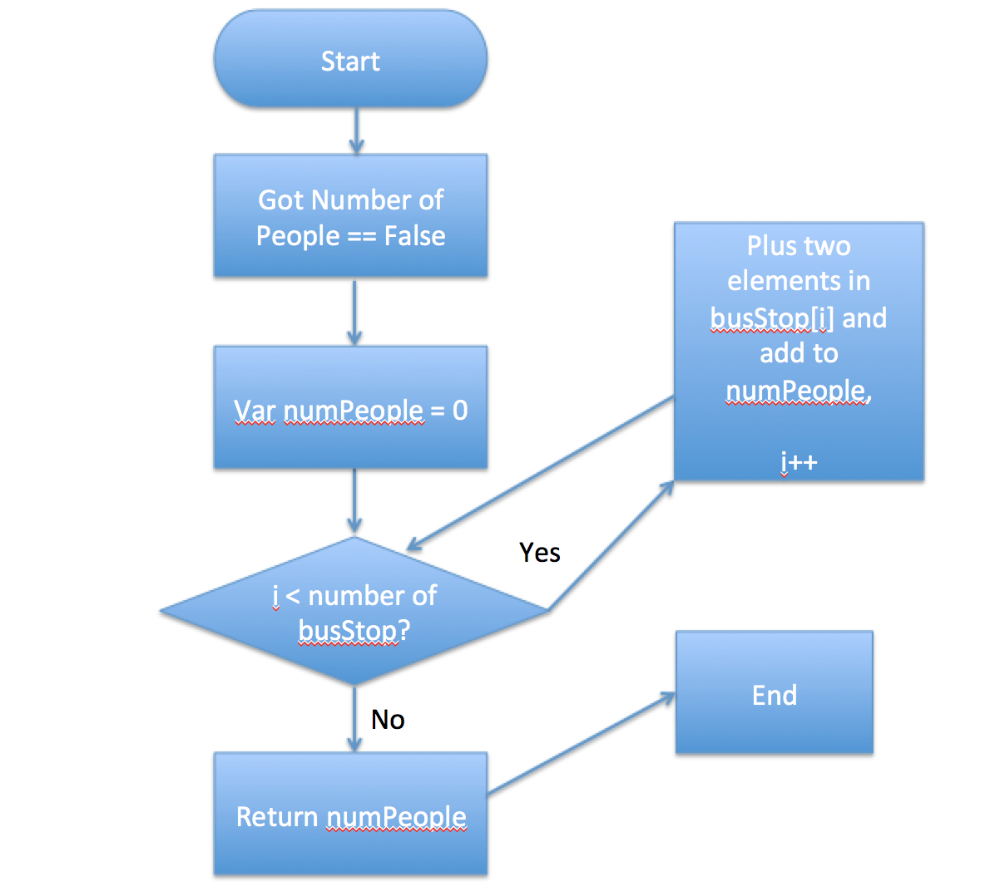

# Problem
```
버스가 첫 정거장에서 출발하여 마지막 정거장까지 간후, 버스에 남아있는 사람의 수를 구해라.
이때, 각 정거장마다 버스를 타는 사람과 내리는 사람이 있을 수 있다.
```

<br>

## Computational Thinking

```
1. 문제인지: 모든 bus Stop이 끝난후, 버스에 남아있는 사람의 수를 구해야한다.

2. 문제 분해: 각 bus Stop마다 버스탄 사람과 내린 사람의 수를 더해 최종적으로 남아있는 사람의 수를 구한다.
    1. 버스에 남아있는 사람의 수 NumPeople = 0을 선언한다.
    2. 반복문을 이용해서 첫 bus Stop(i = 0)부터 마지막 bus Stop까지 각 타는 사람의 수와 내린 사람의 수를 빼서 그 정거장까지 남아있던 사람의 수를 모두 더한다.
    3. 최종적으로, 남아있는 사람의 수(NumPeople)를 리턴한다.

3. 패턴인지: 최종 남아있는 사람의 수를 구하려면, 반복문을 이용해야 한다.

4. 일반화/추상화: 최종 남아있는 사람의 수는 반복문을 통해 {{i번째 각 array의 두 element}}를 계산하여, 그 값을 {{numPeople}}에 쌓음으로써 구현한다.
```

<br>

## Flow Chart




<br>

## Pseudo Code

```
1. Get an array of arrays(each array: first value(number of people who get into bus) and second value(number of people who get off bus) from users ==> busStop, i = 0

2. Set number of people in the bus ==> numPeople = 0

3. While i is less than number of busStop,
    1. Plus two elements in busStop[i], and add to numPeople
    2. if i == number of busStop, then return numPeople
```

<br>

## Algorithm

```
var number = function(busStops){
  var numPeople = 0;
  for(var i = 0; i < busStops.length; i++) {
    var eachStop = busStops[i]; // [10,0]
    numPeople = numPeople + eachStop[0] - eachStop[1];
  }
  return numPeople;
}
```