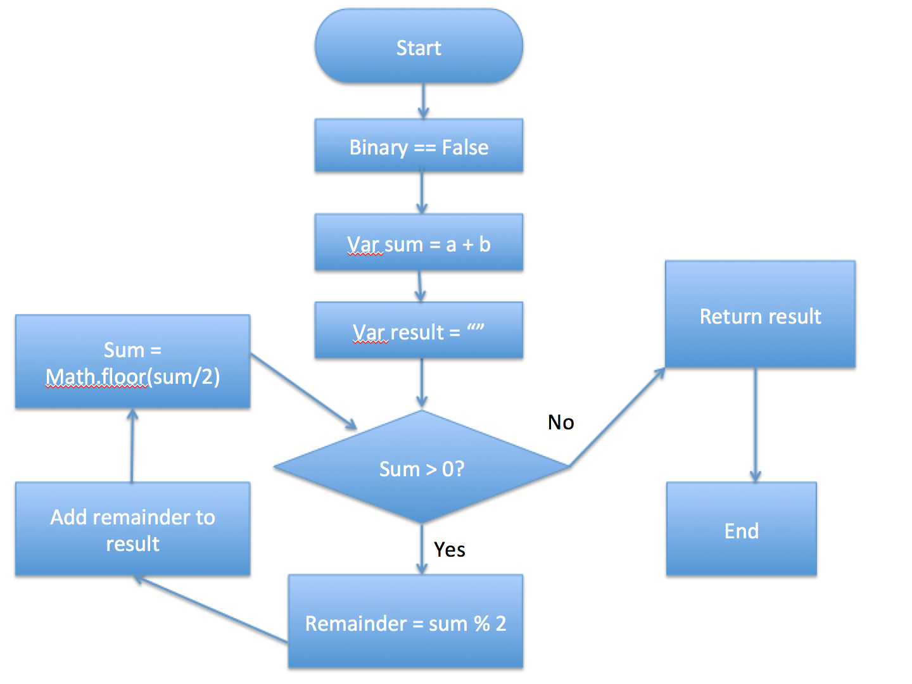

# Problem
```
10진법의 숫자를 2진법으로 바꿔라.
이때, 2진법은 문자열이여야 한다.
```

<br>

## Computational Thinking

```
1. 문제인지: 10진법의 숫자를 2진법의 문자로 바꿔야 한다.

2. 문제분해: 10진법을 2로 나눠, 그 나머지를 문자열의 형태로 모두 더해서 구한다.

    1. 주어진 두 값(a,b)을 sum = a + b로 선언한다.
    2. 최종 2진법의 결과값을 result = “”로 선언한다.
    3. 반복문을 이용해서 구하는데, (sum > 0 일 경우)
        1. remainder(나머지)를  sum % 2로 선언한다.
        2. 그 remainder를 result에 모두 더한다.
        3. sum을 내림한다.
    4. result를 리턴한다.

3. 패턴인지: 2진법의 문자를 구하려면, 반복문을 이용해서 나머지 값을 찾아 모두 더해야 한다.

4. 일반화/추상화: 2진법의 문자는 반복문을 통해, 10진법의 숫자 {{sum}}을 가지고, {{remainder = sum % 2}}를 계산해, {{remainder}} 값을 {{result}}에 쌓아가면서 구현한다.
```

<br>

## Flow Chart




<br>

## Pseudo Code

```
1. Get integers from user ==> a, b
2. Set sum of the integers ==> sum = a + b
3. Set empty string ==> result = “"
4. While sum is more than 0,
    1. Set remainder ==> remainder = sum % 2
    2. Add remainder to result
    3. Set largest number less than sum ==> sum = Math.floor(sum/2)
    4. if sum is not more than 0, then return result

```

<br>

## Algorithm

```
function addBinary(a,b) {
  var sum = a + b;
  var result = "";

  while(sum > 0) {
      var remainder = sum % 2;
      console.log(remainder);
      result = result + remainder;
      sum = Math.floor(sum/2);
      console.log(sum);

  }
  
  return result;
}
```